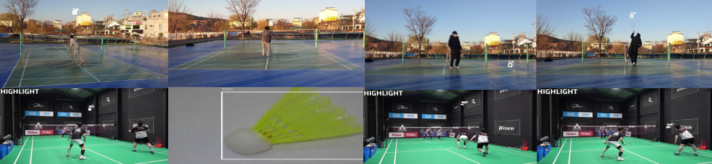
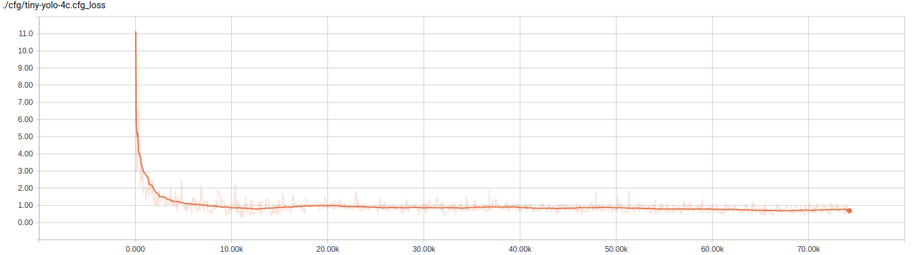
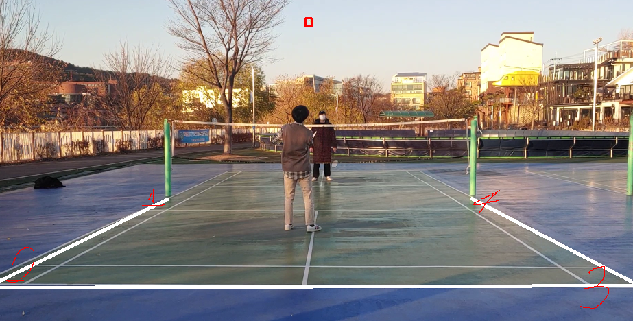
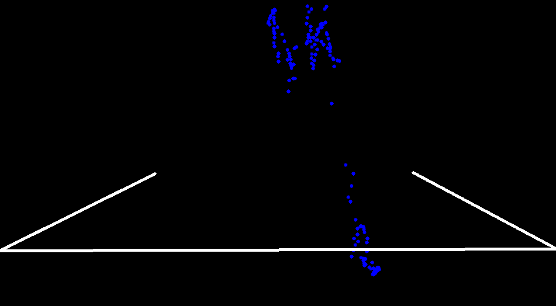
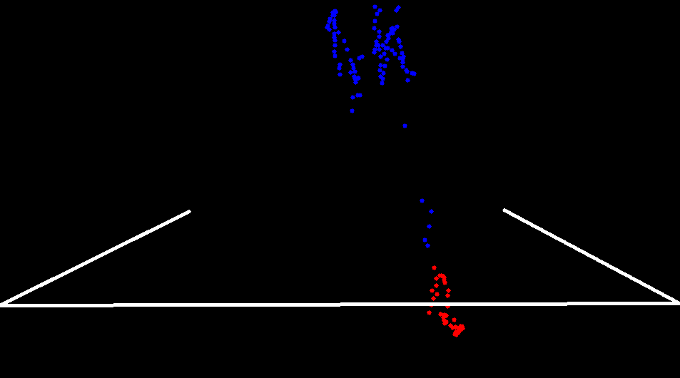
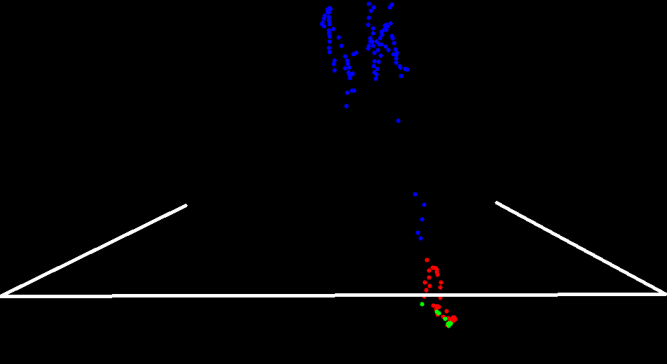
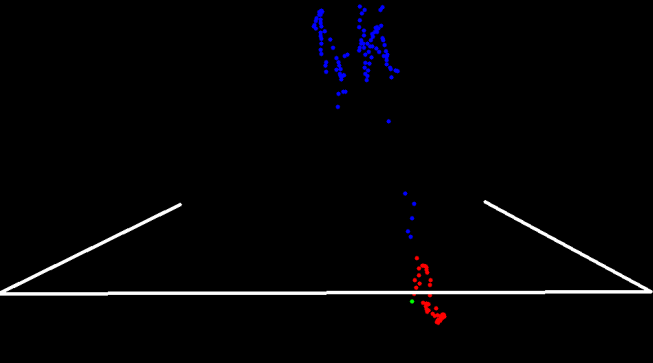
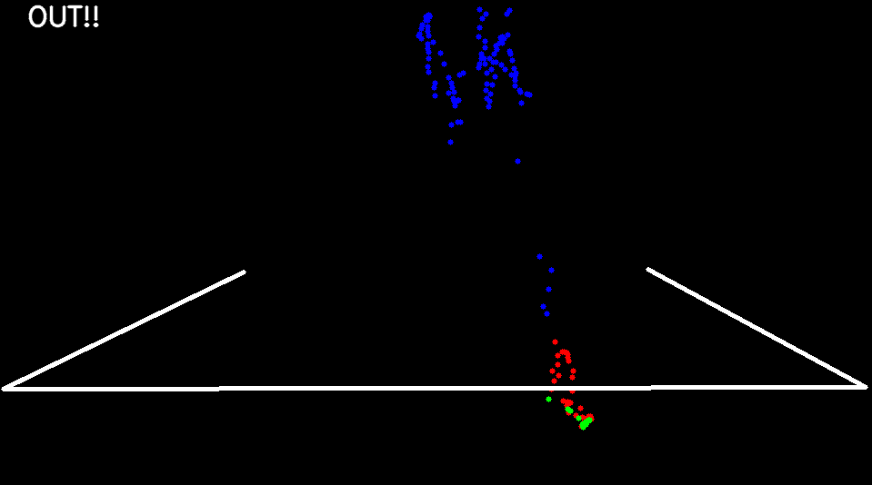

# 물체인식을 통한 라인 아웃 판정

## 환경 구성 

OS : Ubuntu18.04  
Python : 3.6.8  

    Use Conda
    
    conda create -n darkflow python=3.6.8
    conda activate darkflow
    pip install -r requirements.txt

    exit:
    You should install darkflow

## 실행 

    python predict.py

    If you custom movie, modify predict.py 
    
    self.video_path ...
    
    If you custom model, modify predict.py
    
    self.options ...

## models

아래 링크에서 ckpt folder 를 다운받으십시오.  
[Goolge Drive Ckpt](https://drive.google.com/drive/folders/1na0qk9LLN-4bzys3KanZVPkzzl8Vk0xL?usp=sharing)

    train step : 74242
    train dataset : 4000
    eval dataset : 500
    test dataset : 500

    accuracy : 463/500 (92.6%)
    loss : 0.7435123 ...

    

[predict]

[trainloss]

### Step 1

아웃라인 설정  
Set out-line  

배드민턴 코트 라인 바깥쪽을 클릭하십시오.  
(반시계 방향)  

Click 4-point out-line  
(Counterclockwise)  

AND 

스페이스바를 누르십시오.  
PRESS Space

### Step 2

셔틀콕이 Detection된 모든 위치를 확인합니다.  
See all detection shuttlecock location.

### Step 3

아웃라인과 근접한 위치를 선택합니다.  
Select the location closest to the out-line.

### Step 4

기울기 값이 감소에서 증가로 변하는 모든 변곡점을 찾습니다.   
Find the slope where the inflection points changes from decreasing to increasing.

### Step 5

최초 변곡점을 선택합니다.  

Find the first inflection points.  

### Step 6

최종 결과를 확인합니다.

See result.

